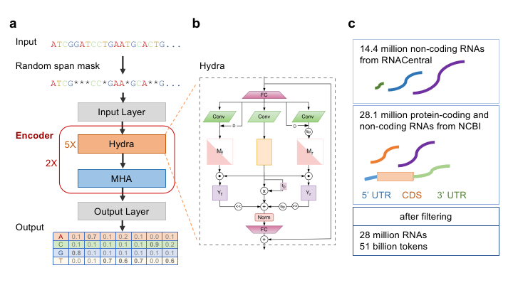

# HydraRNA
HydraRNA is a full-length RNA language model. HydraRNA employs a hybrid architecture with 12 layers. Each layer contains a Hydra module except the 6th and 12th layer, which contains a MHA module. It's pre-trained on both non-coding and protien-coding RNAs. It supports as long as 10K nt of RNA sequences as input.

This repository contains codes and pre-trained models for **RNA feature extraction and secondary structure prediction model**.



We use [fairseq](https://github.com/pytorch/fairseq) sequence modeling framework to train HydraRNA. HydraRNA is based on [Hydra](https://github.com/goombalab/hydra) and [FlashAttention](https://github.com/Dao-AILab/flash-attention). We appreciate these excellent works!


## Create Environment and installation
First, download the repository and create the environment.
```
git clone https://github.com/GuipengLi/HydraRNA

cd ./HydraRNA/fairseq

pip install --editable ./

cd ../

conda env create -f environment.yml
```
Then, activate the "HydraRNA" environment.
```
conda activate HydraRNA
```

## Download the pre-trained models.
You can download the models from our [google drive](https://drive.google.com/drive/folders/14ZXi_aANEEdPa_Sc2cQZtUa4dENPDTkz). Then put these two pt files in the weights directory.


## Usage
We provide example scripts to show how to use HydraRNA to extract embedding and fine-tuning for downstream tasks. As a special case, we also provide example script to show how to use HydraRNA for RNA secondary structure prediction.

### 1. Embedding Extraction

We provide example script to show how to use HydraRNA to extract embedding

```
python extract_HydraAttRNA12_5UTRMRL.py
```


The corresponding feature extraction code is inside this file. For a sequence of length N, the funciton model.encoder.extract_features will return a tensor of size 1 x (N+2) x 1024. We recommend using the mean embedding excluding the special tokens at both ends.


### 2. Fine-tuning

We provide example script to show how to use HydraRNA to fine-tune for downstream tasks.

```
python finetune_HydraAttRNA12_mlp_5UTRMRL_scaled.py
```


### 3. Secondary structure prediction.
```
mkdir predict

python predict_HydraAttRNA12_RNA_SecStruct12.py
```

We used bpRNA datasets prepared by [RiNALMo](https://github.com/lbcb-sci/RiNALMo) directly. The prediction head is also from this repository. This script will output the RNA secondary structures predicted by the HydraRNA in TS0 dataset and a summary file bpRNA_test_HydraRNA_predict_resulst_NOTallow_flexible_pairings.csv.


## Citations

If you find these models useful, please cite our work:

[Li G., Jiang F., et al. HydraRNA: a hybrid architecture based full-length RNA language model. 2025.](https://github.com/GuipengLi/HydraRNA)


## License

This source code is licensed under the MIT license.